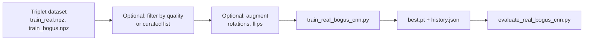

# AstrID Real/Bogus CNN Training

## Technical Documentation

**Version**: 1.0  
**Date**: February 2026  
**Author**: Chris Lawrence

---

## Table of Contents

1. [Training Overview](#training-overview)
2. [Model and Data](#model-and-data)
3. [Training Workflow](#training-workflow)
4. [Training Run Log](#training-run-log)
5. [Next Steps: Testing and Infrastructure](#next-steps-testing-and-infrastructure)
6. [References](#references)

---

## Training Overview

The AstrID real/bogus classifier is a small **Braai-style CNN** that takes **(science, reference, difference)** image triplets (63×63×3) and outputs **P(real)** ∈ [0, 1]. It is used to separate real transients from bogus detections in difference imaging. Training is done in PyTorch; metrics are precision, recall, F1, and **AUCPR** (primary), with best checkpoint saved by validation AUCPR and early stopping.

### High-Level Flow

- **Input**: Triplet NPZ datasets produced by the [data pipeline](DATA_PIPELINE.md) (Stage 5 + `create_training_triplets.py`).
- **Output**: `best.pt` (best checkpoint by val AUCPR), `last.pt`, `history.json`.

---

## Model and Data

### Architecture (Braai-style)

- **Input**: (batch, 3, 63, 63) — channels: reference, science, difference.
- **Conv**: 32 → 64 → 128 filters, 3×3, ReLU, MaxPool.
- **Head**: Flatten → Dense(256) → ReLU → Dropout(0.5) → Dense(1).
- **Output**: Logits; training uses BCEWithLogitsLoss; evaluation uses sigmoid for P(real).

### Data Sources

| Dataset | Description |
|--------|--------------|
| `output/datasets/best_yield/training_triplets` | Best-yield SNe, no augmentation (311 samples). |
| `output/datasets/best_yield/training_triplets_aug` | Same, with 6× augmentation (~1866 samples). |
| `output/datasets/best_yield/training_triplets_quality` | Quality-filtered (no constant/void/band cutouts). |
| `output/datasets/best_yield/training_triplets_curated` | Hand-curated keys from `curated.txt` (real + bogus per key). |

### Scripts

| Script | Purpose |
|--------|--------|
| `scripts/train_real_bogus_cnn.py` | Train model; saves best by val AUCPR; early stopping; optional weight decay. |
| `scripts/evaluate_real_bogus_cnn.py` | Evaluate a checkpoint on val split; reports P/R/F1, AUCPR, confusion matrix. |
| `scripts/filter_triplet_npz_quality.py` | Drop samples where ref/sci fail `is_usable_cutout` (constant, black void, center void, shade bands). |
| `scripts/filter_triplet_npz_by_list.py` | Keep only samples whose key (SN_mission_filter) is in a list; optional `--copy-visualizations`. |
| `scripts/augment_triplet_npz.py` | Expand existing NPZ with rotations and flips (~6× samples). |

---

## Training Workflow

1. **Build triplets** (see [DATA_PIPELINE.md](DATA_PIPELINE.md)): FITS + difference images → `create_training_triplets.py` → `train_real.npz`, `train_bogus.npz`. Use `--no-quality-filter` if you want all cutouts for later curation.
2. **Optional quality filter**: Run `filter_triplet_npz_quality.py` to remove constant/void/band cutouts.
3. **Optional curation**: Edit `curated.txt` (one key `SN_mission_filter` per line); run `filter_triplet_npz_by_list.py` with `--copy-visualizations` to get a small, clean set and its PNGs.
4. **Optional augmentation**: Run `augment_triplet_npz.py` on the chosen triplet dir to multiply sample count.
5. **Train**: `train_real_bogus_cnn.py --triplet-dir <dir> --output-dir output/models/real_bogus_cnn --epochs 100 --batch-size 32`.
6. **Evaluate**: `evaluate_real_bogus_cnn.py --checkpoint output/models/real_bogus_cnn/best.pt --triplet-dir <same or holdout dir>`.

---

## Training Run Log

Summary of runs for reporting. Best val AUCPR and dataset/settings are the main comparison.

| Run | Dataset | Samples (real / bogus) | Augment | Best val AUCPR | Notes |
|-----|--------|------------------------|--------|----------------|------|
| 1 | best_yield/training_triplets | 199 / 112 (311) | No | **0.90** | All data including junky cutouts. |
| 2 | best_yield/training_triplets_aug | 1194 / 672 (1866) | Yes (6×) | **0.93** | Same source with augmentation. |
| 3 | best_yield/training_triplets_quality | — | No | **0.78** | After removing white/black/no-data cutouts; no augment. |
| 4 | best_yield/training_triplets_quality + aug | — | Yes | **0.90** | Quality-filtered + augmentation. |
| 5 | best_yield/training_triplets_curated | 36 / 30 (66) | No | **0.968** | Hand-curated keys only; small N, high variance warning. |
| 6 | best_yield/training_triplets_curated_aug | 216 / 180 (396) | Yes (6×) | **1.000** | Augmented curated set; likely overfitting, limited variation—tracking for comparison. |

- Run 5 used `curated.txt` (keys only) and `filter_triplet_npz_by_list.py` with `--copy-visualizations`. Best checkpoint at epoch 2 (early stop by epoch 17). With 66 samples, val metrics are noisy; AUCPR 0.968 is strong but should be confirmed on a holdout or more data.
- Run 6: augmented curated (same 46 keys × 6 augment → 396 samples). Best val AUCPR 1.000 at epoch 14; early stop at 29. Val set is small and drawn from same keys, so 1.000 is likely overfitting / memorization rather than true generalization—useful to track for reporting.

---

## Next Steps: Testing and Infrastructure

### 1. Test that the model identifies change in images

- **Evaluate on holdout data**: Use `evaluate_real_bogus_cnn.py` with a different triplet dir (e.g. another survey or a held-out set of SNe) to measure generalization, not just val AUCPR on the same distribution.
- **Inference on new triplets**: Add or use a small script that loads `best.pt`, loads a single NPZ or a directory of triplets, runs the model, and writes scores (and optionally a CSV or JSON). That gives you “can it identify change?” on arbitrary new cutouts.
- **Qualitative check**: Run the evaluator on the curated set and inspect the confusion matrix and any misclassified samples to see if errors are interpretable (e.g. borderline cases, artifacts).

### 2. Hook training into MLflow and infrastructure

Existing pieces:

- **`src/infrastructure/mlflow/`**: `ExperimentTracker` (start_run, log_parameters, log_metrics, log_artifacts), `MLflowConfig` (tracking URI, artifact root, env-based config). Use this to log each training run: params (triplet_dir, epochs, batch_size, weight_decay, etc.), metrics (train_loss, val_precision, val_recall, val_f1, val_aucpr per epoch and best), and artifacts (best.pt, history.json).
- **`src/adapters/scheduler/flows/model_training.py`**: Prefect flow for “train model” (currently U-Net mock: prepare_training_data → train_unet_model → evaluate_model → register_model). It already uses GPU monitoring and MLflow energy tracking. For real/bogus CNN you can either:
  - **Option A**: Add a separate flow (e.g. `train_real_bogus_cnn_flow`) that calls your training script or inlines the training loop, and logs to MLflow via `ExperimentTracker` and optionally registers the best.pt model.
  - **Option B**: Refactor `train_real_bogus_cnn.py` so the training loop can be invoked from Python (e.g. a `run_training(triplet_dir, output_dir, ...)` function) and call that from the existing flow structure, with MLflow logging and artifact storage (e.g. R2/S3 via your storage config).

Concrete steps:

1. **MLflow logging in `train_real_bogus_cnn.py`**: After parsing args, create an experiment (e.g. "real-bogus-cnn"), start a run, log all CLI args as params, and each epoch log train_loss and val P/R/F1/AUCPR; at the end log best val AUCPR and save best.pt (and optionally history.json) as run artifacts. Use `MLflowConfig.from_env()` and `ExperimentTracker` so it works with your existing MLflow server (e.g. `MLFLOW_TRACKING_URI`).
2. **Connect data to infrastructure**: Ensure triplet datasets are identifiable (e.g. path or dataset_version). In the flow, “prepare data” can point to a specific triplet dir or a versioned artifact; then pass that path into the real/bogus training step so every run is tied to a known dataset.
3. **Model registry**: When a run meets a threshold (e.g. val AUCPR ≥ 0.92), register the run’s best.pt in the MLflow model registry so deployment or evaluation pipelines can pull the same artifact.

---

## References

- **Pipeline (data)**: [DATA_PIPELINE.md](DATA_PIPELINE.md)
- **MLflow**: `src/infrastructure/mlflow/experiment_tracker.py`, `config.py`
- **Training flow**: `src/adapters/scheduler/flows/model_training.py`
- **Real/bogus CNN**: `src/domains/detection/architectures/real_bogus_cnn.py`

---

*Document updated from training runs and pipeline usage — February 2026*
