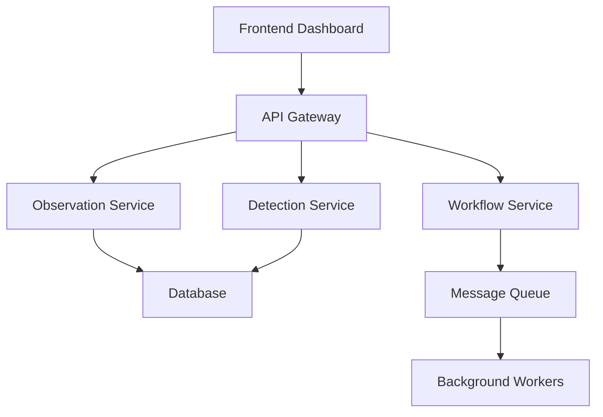

## **ASTR-99: Technical Documentation (P3) - Documentation**

### **Context & Current State**
Core API endpoints are complete (ASTR-84 ✅), providing the foundation for comprehensive technical documentation. This ticket creates detailed technical documentation including API documentation, architecture documentation, deployment guides, and user manuals.

### **Technical Requirements**

**Dependencies**: ASTR-84 (Core API Endpoints) - ✅ Complete
**Domain**: Documentation
**Estimated Time**: 4 days

### **Implementation Tasks**

1. **Write API Documentation**
   - Create `docs/api/` directory structure
   - Implement comprehensive API documentation:
     - `api-reference.md` - Complete API reference
     - `authentication.md` - Authentication and authorization
     - `endpoints.md` - Detailed endpoint documentation
     - `examples.md` - Code examples and tutorials
     - `sdk.md` - Software development kit documentation
   - Add interactive API documentation with Swagger UI
   - Create API changelog and versioning guide
   - Add API troubleshooting and FAQ

2. **Create Architecture Documentation**
   - Create `docs/architecture/` directory structure
   - Implement architecture documentation:
     - `system-overview.md` - High-level system architecture
     - `domain-models.md` - Domain-driven design documentation
     - `data-flow.md` - Data flow and processing pipelines
     - `integration-patterns.md` - Integration and communication patterns
     - `security-architecture.md` - Security design and implementation
   - Add system diagrams and visualizations
   - Create technology stack documentation
   - Add performance and scalability documentation

3. **Add Deployment Guides**
   - Create `docs/deployment/` directory structure
   - Implement deployment documentation:
     - `local-development.md` - Local development setup
     - `staging-deployment.md` - Staging environment deployment
     - `production-deployment.md` - Production deployment guide
     - `docker-deployment.md` - Docker container deployment
     - `kubernetes-deployment.md` - Kubernetes deployment guide
   - Add environment configuration guides
   - Create monitoring and maintenance guides
   - Add troubleshooting and recovery procedures

4. **Write User Manuals**
   - Create `docs/user-guides/` directory structure
   - Implement user documentation:
     - `getting-started.md` - Getting started guide
     - `user-interface.md` - Dashboard and UI documentation
     - `workflow-guide.md` - User workflow documentation
     - `data-management.md` - Data management guide
     - `troubleshooting.md` - User troubleshooting guide
   - Add screenshots and visual guides
   - Create video tutorials and walkthroughs
   - Add best practices and tips

### **Integration Points**

- **API**: Document all ASTR-84 API endpoints
- **Architecture**: Document system design and patterns
- **Deployment**: Guide deployment and operations
- **Users**: Support user onboarding and training
- **Development**: Support developer onboarding

### **Documentation Structure**
```
docs/
├── api/
│   ├── api-reference.md
│   ├── authentication.md
│   ├── endpoints.md
│   ├── examples.md
│   └── sdk.md
├── architecture/
│   ├── system-overview.md
│   ├── domain-models.md
│   ├── data-flow.md
│   ├── integration-patterns.md
│   └── security-architecture.md
├── deployment/
│   ├── local-development.md
│   ├── staging-deployment.md
│   ├── production-deployment.md
│   ├── docker-deployment.md
│   └── kubernetes-deployment.md
├── user-guides/
│   ├── getting-started.md
│   ├── user-interface.md
│   ├── workflow-guide.md
│   ├── data-management.md
│   └── troubleshooting.md
└── README.md
```

### **API Documentation Configuration**
```yaml
# API Documentation Settings
api_docs:
  title: "AstrID API"
  version: "1.0.0"
  description: "Astronomical Identification System API"
  base_url: "https://api.astrid.com/v1"
  authentication:
    type: "bearer"
    scheme: "jwt"
  examples:
    languages: ["python", "javascript", "curl"]
    environments: ["production", "staging"]
```

### **Architecture Documentation**


### **Deployment Configuration**
```yaml
# Deployment Configuration
deployment:
  environments:
    development:
      database: "sqlite"
      storage: "local"
      workers: 1
    staging:
      database: "postgresql"
      storage: "r2"
      workers: 3
    production:
      database: "postgresql"
      storage: "r2"
      workers: 10
```

### **Error Handling**
- Documentation validation and testing
- Link checking and validation
- Content accuracy verification
- Version control and change tracking
- Comprehensive review and approval process

### **Testing Strategy**
- Documentation accuracy testing
- Link and reference validation
- User acceptance testing for guides
- Technical review and validation
- Content quality assessment

### **Performance Considerations**
- Documentation generation and build optimization
- Search functionality and indexing
- Content delivery and caching
- Version control and branching
- Content maintenance and updates
