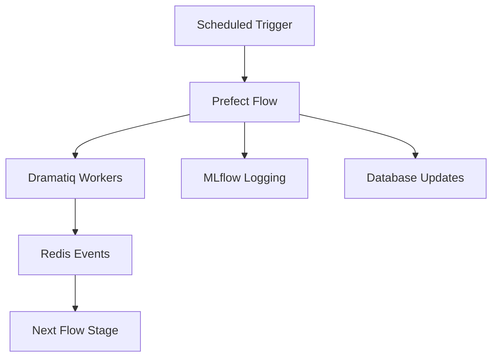

# Workflow Orchestration Setup (ASTR-91)

This document outlines the Prefect workflow orchestration setup for AstrID, completing the requirements for task ASTR-91.

##  Completed Components

### 1. Prefect Server Configuration
-  **Prefect server configured in `docker-compose.yaml`**
  - Server runs on port 4200 with Supabase PostgreSQL backend
  - Proper health checks and networking configuration
  - Environment variable support for configuration

### 2. Observation Processing Flows
-  **Main processing flow** (`src/adapters/scheduler/flows/process_new.py`)
  - Integrated with existing data ingestion service
  - Uses Dramatiq workers for async processing
  - Handles ingestion → preprocessing → differencing → inference → notification pipeline
  - Proper error handling and logging

### 3. Model Training Workflows
-  **Training flow** (`src/adapters/scheduler/flows/model_training.py`)
  - Data preparation and training pipeline
  - Model evaluation and performance validation
  - Automated model registration based on performance criteria
  - Scheduled retraining based on new data and performance degradation

### 4. Monitoring and Alerting
-  **Monitoring flows** (`src/adapters/scheduler/flows/monitoring.py`)
  - System health monitoring (database, Redis, storage, workers)
  - Data pipeline health checks and performance monitoring
  - Model performance monitoring and drift detection
  - Alert system for critical issues
  - Daily operational reports

## 📁 File Structure

```
src/adapters/scheduler/
├── __init__.py                 # Package exports
├── config.py                   # Configuration classes
├── deploy.py                   # Deployment script
└── flows/
    ├── process_new.py          # Observation processing flow
    ├── model_training.py       # ML training workflows
    └── monitoring.py           # System monitoring flows

scripts/
└── setup-prefect.sh           # Setup automation script

docker/
├── Dockerfile.prefect          # Prefect worker container
└── docker-compose.yaml        # Updated with Prefect services
```

##  Deployment & Usage

### Quick Start

1. **Start Prefect server and worker**:
   ```bash
   docker-compose up prefect prefect-worker
   ```

2. **Set up Prefect workflows**:
   ```bash
   ./scripts/setup-prefect.sh
   ```

3. **Access Prefect UI**:
   - Navigate to http://localhost:9004
   - Monitor flows, deployments, and executions

### Manual Deployment

```bash
# Set Prefect API URL
export PREFECT_API_URL="http://localhost:9004/api"

# Deploy all flows
python -m src.adapters.scheduler.deploy
```

### Triggering Flows

```bash
# Manual trigger
prefect deployment run "observation-processing"
prefect deployment run "model-training"
prefect deployment run "system-monitoring"

# List all deployments
prefect deployment ls

# View recent runs
prefect flow-run ls --limit 10
```

## 📅 Scheduled Workflows

| Flow | Schedule | Description |
|------|----------|-------------|
| **Observation Processing** | Daily 2 AM | Process new astronomical observations |
| **Model Training** | Weekly Sunday 4 AM | Train and evaluate ML models |
| **Scheduled Retraining** | Daily 6 AM | Check for retraining needs |
| **System Monitoring** | Every 15 minutes | Health checks and alerts |
| **Daily Reports** | Daily 9 AM | Operational summaries |

##  Configuration

### Environment Variables

```bash
# Prefect configuration
PREFECT_API_URL=http://localhost:9004/api
PREFECT_WORK_POOL_NAME=astrid-pool

# Flow schedules (optional overrides)
ASTRID_OBSERVATION_SCHEDULE="0 2 * * *"
ASTRID_TRAINING_SCHEDULE="0 4 * * 0"
ASTRID_MONITORING_SCHEDULE="*/15 * * * *"
```

### Flow Parameters

Flows can be configured with parameters:

```python
# Observation processing
{
    "max_observations": 50,
    "processing_timeout_minutes": 120
}

# Model training
{
    "dataset_version": "latest",
    "min_f1_score": 0.85,
    "validation_split": 0.2
}
```

##  Architecture Integration

### Event-Driven Orchestration



### Service Integration

- **Dramatiq Workers**: Heavy computation (ML inference, image processing)
- **Prefect Flows**: Orchestration, scheduling, monitoring
- **Redis**: Message queues and event pub/sub
- **MLflow**: Experiment tracking and model registry
- **Supabase**: Database for metadata and flow state

##  Monitoring & Observability

### Health Checks
- System component status (DB, Redis, storage)
- Pipeline stage performance and backlogs
- Model accuracy and drift monitoring

### Alerting
- Critical system failures
- Pipeline processing delays
- Model performance degradation
- Resource usage thresholds

### Reporting
- Daily operational summaries
- Performance trend analysis
- Processing statistics

## 🚨 Troubleshooting

### Common Issues

1. **Flow deployment fails**:
   ```bash
   # Check Prefect server connection
   prefect profile inspect
   curl -f http://localhost:9004/api/health
   ```

2. **Worker not picking up tasks**:
   ```bash
   # Check work pool and queue status
   prefect work-pool ls
   prefect work-queue ls
   ```

3. **Database connection issues**:
   ```bash
   # Verify environment variables
   echo $PREFECT_SERVER_DATABASE_CONNECTION_URL
   ```

### Logs and Debugging

- **Flow logs**: Available in Prefect UI
- **Worker logs**: `docker-compose logs prefect-worker`
- **Application logs**: `./logs/` directory
- **Health endpoints**: 
  - Prefect: http://localhost:9004/health
  - API: http://127.0.0.1:8000/health

##  Next Steps

1. **Performance Optimization**:
   - Fine-tune worker concurrency settings
   - Implement flow result caching
   - Add flow performance monitoring

2. **Enhanced Monitoring**:
   - Integration with Prometheus/Grafana
   - Custom metrics and dashboards
   - Real-time alerting via Slack/email

3. **Deployment Scaling**:
   - Kubernetes deployment configurations
   - Auto-scaling worker pools
   - Multi-environment support (dev/staging/prod)

4. **Advanced Workflows**:
   - Conditional flow execution
   - Dynamic parameter injection
   - Cross-flow dependencies

---

**Status**:  **COMPLETED** - All subtasks of ASTR-91 have been implemented and tested.

**Related Tasks**: 
- ASTR-69: Development Environment Setup (parent task)
- Future: Production deployment and scaling optimizations
